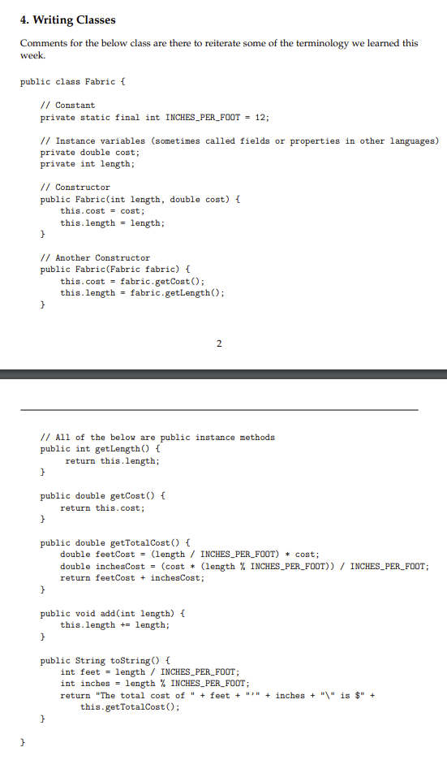
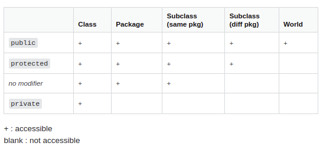
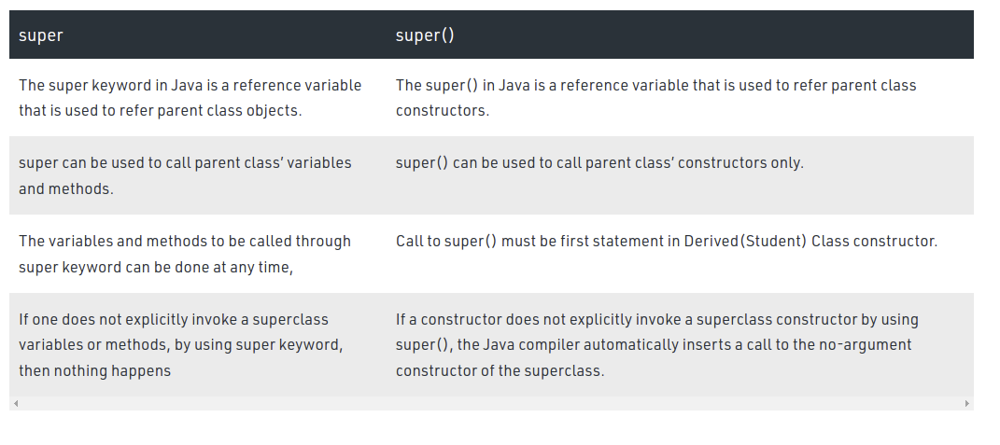
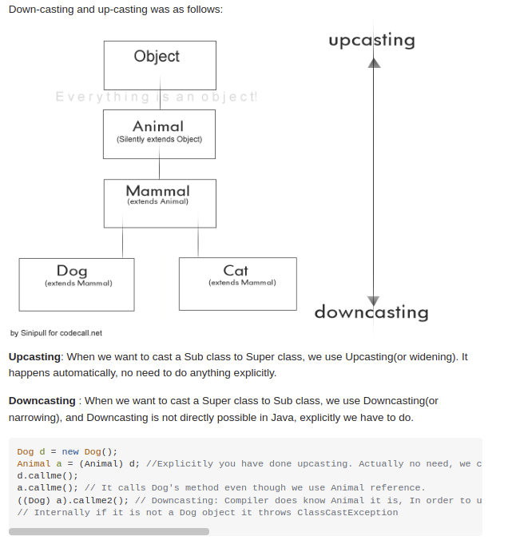
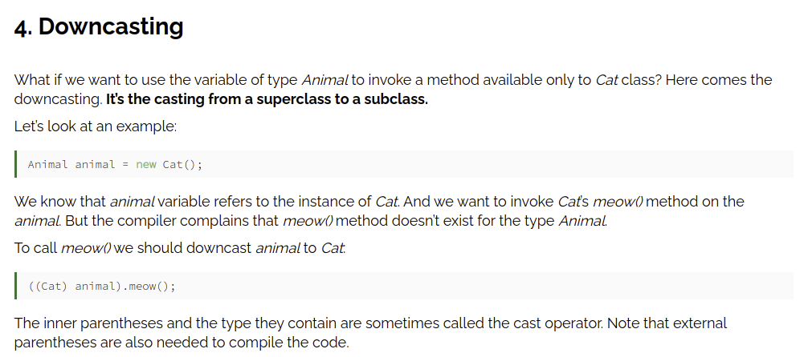
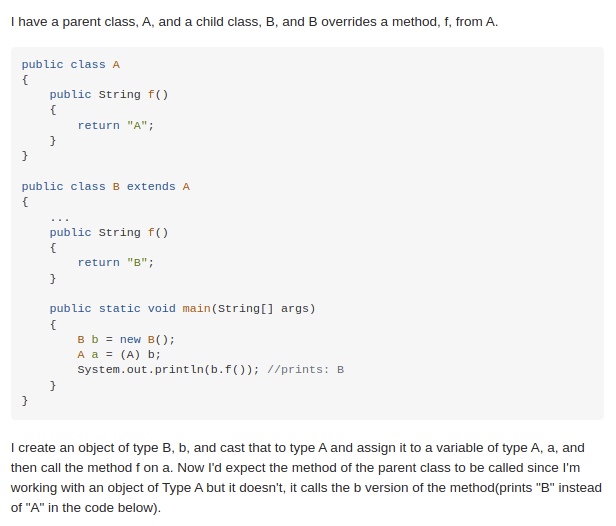
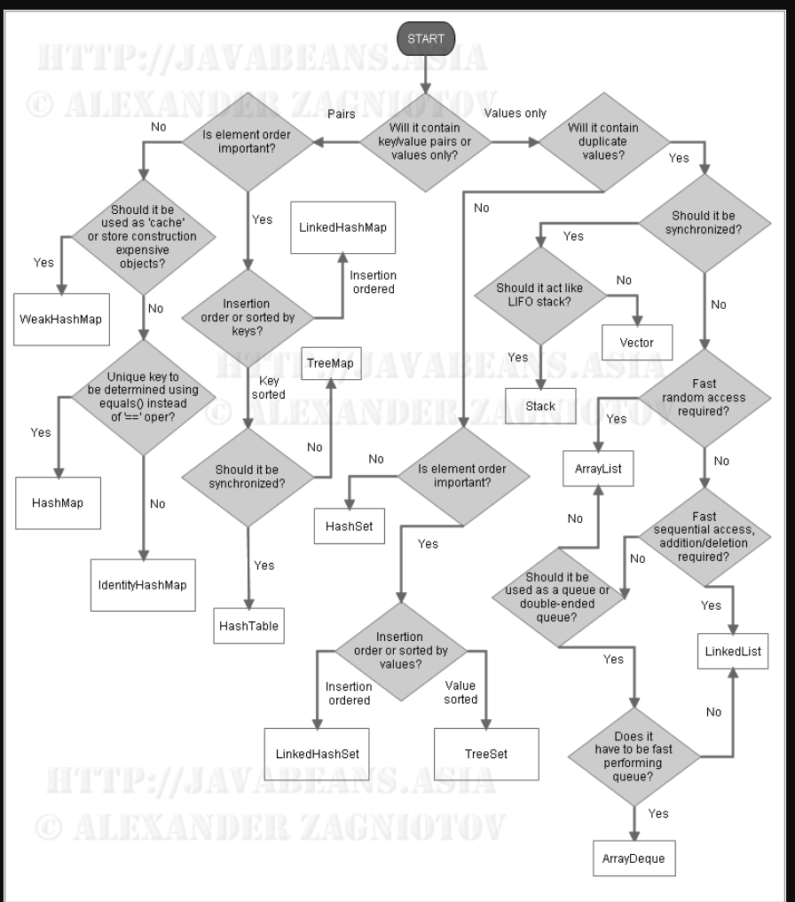
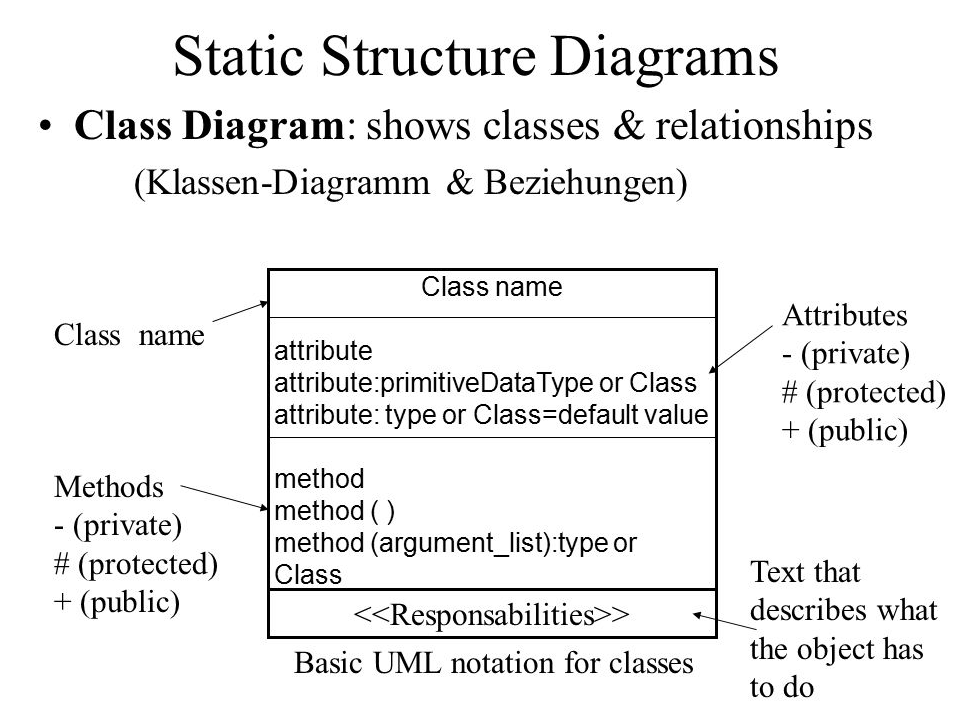
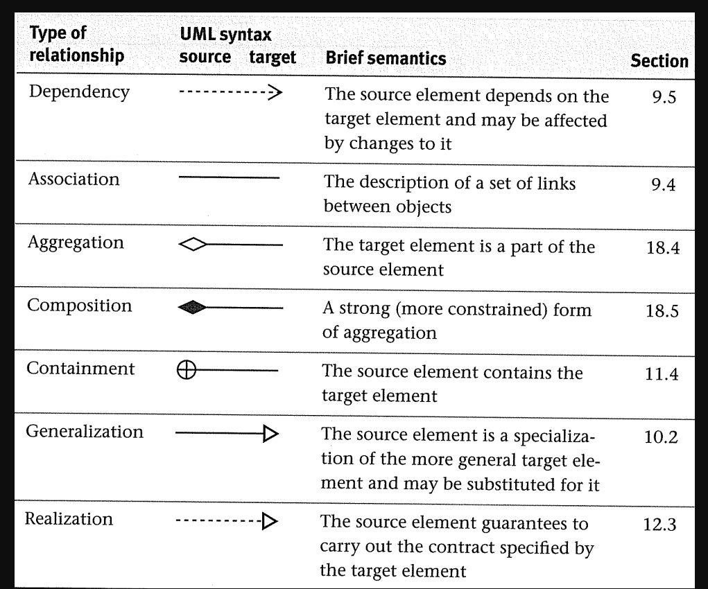

Gittings Bldg, Rm 129B, MoWeFr 9:00AM - 9:50AM


<!-- TOC -->

- [midterm 2](#midterm-2)
  - [Writing Classes](#writing-classes)
  - [Interface vs Abstract Class](#interface-vs-abstract-class)
  - [Interface](#interface)
    - [Why And When To Use Interfaces?](#why-and-when-to-use-interfaces)
  - [Abstract Class](#abstract-class)
  - [Protection Levels](#protection-levels)
  - [Super](#super)
  - [Modifiers](#modifiers)
  - [Inner Classes](#inner-classes)
  - [Double Brace](#double-brace)
  - [Upcast Downcast](#upcast-downcast)
    - [Downcasting Example](#downcasting-example)
  - [Data Structures](#data-structures)
  - [UML Diagrams](#uml-diagrams)
- [midterm 1](#midterm-1)
  - [Study Guide Solutions](#study-guide-solutions)
  - [Syntax](#syntax)
  - [Read](#read)
    - [From Stdin](#from-stdin)
  - [From File](#from-file)
  - [Collections](#collections)
    - [Methods](#methods)
    - [Hasmap](#hasmap)
    - [LinkedList](#linkedlist)
    - [Stack](#stack)
    - [Queue](#queue)
  - [Lambda](#lambda)
  - [Recursion](#recursion)

<!-- /TOC -->

# midterm 2

## Writing Classes




## Interface vs Abstract Class

https://www.guru99.com/interface-vs-abstract-class-java.html

https://www.geeksforgeeks.org/difference-between-abstract-class-and-interface-in-java/


## Interface

Notes on Interfaces:
- Like abstract classes, interfaces cannot be used to create objects (in the example above, it is not possible to create an "Animal" object in the MyMainClass)
- Interface methods do not have a body - the body is provided by the "implement" class
- On implementation of an interface, you must override all of its methods
- Interface methods are by default abstract and public
- Interface attributes are by default public, static and final
- An interface cannot contain a constructor (as it cannot be used to create objects)


### Why And When To Use Interfaces?

1. To achieve security - hide certain details and only show the important details of an object (interface).
2. Java does not support "multiple inheritance" (a class can only inherit from one superclass). However, it can be achieved with interfaces, because the class can implement multiple interfaces. Note: To implement multiple interfaces, separate them with a comma (see example below).


## Abstract Class

```java
// Abstract class
abstract class Animal {
  // Abstract method (does not have a body)
  public abstract void animalSound();
  // Regular method
  public void sleep() {
    System.out.println("Zzz");
  }
}

// Subclass (inherit from Animal)
class Pig extends Animal {
  public void animalSound() {
    // The body of animalSound() is provided here
    System.out.println("The pig says: wee wee");
  }
}

class Main {
  public static void main(String[] args) {
    Pig myPig = new Pig(); // Create a Pig object
    myPig.animalSound();
    myPig.sleep();
  }
}
```


## Protection Levels



## Super




## Modifiers

https://www.w3schools.com/java/java_modifiers.asp

## Inner Classes

```java
class OuterClass {
  int x = 10;

  class InnerClass {
    int y = 5;
  }
}

public class Main {
  public static void main(String[] args) {
    OuterClass myOuter = new OuterClass();
    OuterClass.InnerClass myInner = myOuter.new InnerClass();
    System.out.println(myInner.y + myOuter.x);
  }
}

// Outputs 15 (5 + 10)
```

Unlike a "regular" class, an inner class can be private or protected. If you don't want outside objects to access the inner class, declare the class as private:

An inner class can also be static, which means that you can access it without creating an object of the outer class:


```java
class OuterClass {
  int x = 10;

  static class InnerClass {
    int y = 5;
  }
}

public class Main {
  public static void main(String[] args) {
    OuterClass.InnerClass myInner = new OuterClass.InnerClass();
    System.out.println(myInner.y);
  }
}

// Outputs 5
```

## Double Brace

Double brace initialisation creates an anonymous class derived from the specified class (the outer braces), and provides an initialiser block within that class (the inner braces). e.g.


```java
new ArrayList<Integer>() {{
   add(1);
   add(2);
}};
```


Note that an effect of using this double brace initialisation is that you're creating anonymous inner classes. The created class has an implicit this pointer to the surrounding outer class. Whilst not normally a problem, it can cause grief in some circumstances e.g. when serialising or garbage collecting, and it's worth being aware of this.

## Upcast Downcast

Upcasting is casting to a supertype, while downcasting is casting to a subtype. Upcasting is always allowed, but downcasting involves a type check and can throw a ClassCastException.

In your case, a cast from a Dog to an Animal is an upcast, because a Dog is-a Animal. In general, you can upcast whenever there is an is-a relationship between two classes.

Downcasting would be something like this:

```java
Animal animal = new Dog();
Dog castedDog = (Dog) animal;
```


Basically what you're doing is telling the compiler that you know what the runtime type of the object really is. The compiler will allow the conversion, but will still insert a runtime sanity check to make sure that the conversion makes sense. In this case, the cast is possible because at runtime animal is actually a Dog even though the static type of animal is Animal.

However, if you were to do this:

```java
Animal animal = new Animal();
Dog notADog = (Dog) animal;
```

You'd get a ClassCastException. The reason why is because animal's runtime type is Animal, and so when you tell the runtime to perform the cast it sees that animal isn't really a Dog and so throws a ClassCastException.

To call a superclass's method you can do super.method() or by performing the upcast.

To call a subclass's method you have to do a downcast. As shown above, you normally risk a ClassCastException by doing this; however, you can use the instanceof operator to check the runtime type of the object before performing the cast, which allows you to prevent ClassCastExceptions:

```java
Animal animal = getAnimal(); // Maybe a Dog? Maybe a Cat? Maybe an Animal?
if (animal instanceof Dog) {
    // Guaranteed to succeed, barring classloader shenanigans
    Dog castedDog = (Dog) animal;
}
```


Downcasts can be expressed more succinctly starting from Java 16, which introduced pattern matching for instanceof:

```java
Animal animal = getAnimal(); // Maybe a Dog? Maybe a Cat? Maybe an Animal?
if (animal instanceof Dog castedDog) {
    // now castedDog is available here as in the example above
}
```




### Downcasting Example




------




This is basis of polymorphism
And it is supposed to work like that.

Any method is dispatched (selected/invoked) dynamically according to the actual type of the object in stead of the type by which it is being referred to.

When you cast the object to another type, you just refer it using another type. The actual type of the object is not changed. (And it can never change).

So the behavior that you are observing is as expected and it is designed to be that way. It's definitely not a limitation.

## Data Structures



## UML Diagrams






-------


downcasting: takes override 

must be instanceof


# midterm 1


## Study Guide Solutions

- [one](https://cdn-uploads.piazza.com/paste/jkykqjht9g62hy/c13ef8bdbff55be8f02b51bc3f9afbc78c3517f8de25af69f4f32cfb9ce6d849/Section1-Solutions.pdf)
- [two](https://cdn-uploads.piazza.com/paste/jkykqjht9g62hy/163f86a7b861ce30b32fd8e06013d85ac93aed7c2450059d9d921a1177096841/Section2-Solutions.pdf)
- [three](https://cdn-uploads.piazza.com/paste/jkykqjht9g62hy/76243c686378dd5cb71b764ab6a38380cda40652491a29e4e6200ce9d0df0b58/Section3-Solutions.pdf)

## Syntax


```java
public class Main {
  public static void main(String[] args) {
    System.out.println("Hello World");
  }
}
```

- Every line of code that runs in Java must be inside a class
- The name of the java file must match the class name
- The `main()` method is required
  - Any code inside the main() method will be executed.

## Read

### From Stdin

```java
import java.io.*;

      BufferedReader br = new BufferedReader(new InputStreamReader(System.in));
      try {
         System.out.println("Enter a first number:");
         firstNum = Integer.parseInt(br.readLine());
         System.out.println("Enter a second number:");
         secondNum = Integer.parseInt(br.readLine());
         result = firstNum * secondNum;
         System.out.println("The Result is: " + result);
      } catch (IOException ioe) {
         System.out.println(ioe);
      }
```


```java
import java.util.*;

      int firstNum;
      Scanner scanner = new Scanner(System.in);
      System.out.println("prompt:");
      firstNum = Integer.parseInt(scanner.nextLine());
      System.out.println("Entersult is: " + result);
```


## From File


`Files.readAllLines -> List<String>`


```java
      // Reduce column to string and append to rotated puzzle (it's now a row).
      ret.add(
        columnChars.stream().map(String::valueOf).collect(Collectors.joining())
      );
    }
    return ret.toArray(new String[0]);
  }
```


```java
  public static String[] parseFile(String path, Integer minLength)
    throws java.io.IOException {
    return Files
      .readAllLines(Paths.get(path))
      .stream()
      .filter(word -> word.length() >= minLength)
      .map(word -> word.replace(" ", "").toLowerCase())
      .collect(Collectors.toList())
      .toArray(new String[0]);
  }
```


```java
import java.nio.*;
public class ReadingFromFile
{
  public static void main(String[] args) throws Exception
  {
      Files
        .readAllLines(Paths.get(args[0]))
        .forEach(line -> System.out.prinln(line));
  }
}
```


```java
import java.io.*;
import java.util.*;

public class ReadFromFileUsingScanner
{
  public static void main(String[] args) throws Exception
  {
    File file =
      new File("C:\\Users\\pankaj\\Desktop\\test.txt");
    Scanner sc = new Scanner(file);
  
    while (sc.hasNextLine())
  }
}
```

## Collections


### Methods

```
contains
add
get
put
remove
size
clear
set
```

### Hasmap

```java
HashMap<String, String> capitalCities = new HashMap<String, String>();
    capitalCities.put("England", "London");

for (String i : capitalCities.keySet()) {
  System.out.println(i);
}

for (String i : capitalCities.values()) {
  System.out.println(i);
}
```

### LinkedList

```
addFirst
addLast
removeFirst
removeLast
getFirst
getLast
```


### Stack

```
empty
peek
pop
push
```

### Queue

```
isempty
peek
remove
add
```

A collection designed for holding elements prior to processing. Besides basic Collection operations, queues provide additional insertion, extraction, and inspection operations. Each of these methods exists in two forms: one throws an exception if the operation fails, the other returns a special value (either null or false, depending on the operation). The latter form of the insert operation is designed specifically for use with capacity-restricted Queue implementations; in most implementations, insert operations cannot fail.

<table class="table table-bordered">
<tbody><tr>
<td>&nbsp;</td>
<td>Collection Class name</td>
<td>Ordered</td>
<td>Sorted</td>
</tr>
<tr>
<td rowspan="4">Map</td>
<td>Hashtable</td>
<td>No</td>
<td>No</td>
</tr>
<tr> <td>HashMap</td>
<td>No</td>
<td>No</td>
</tr>
<tr>
<td>TreeMap</td>
<td>Sorted</td>
<td>By natural order or custom order</td>
</tr>
<tr>
<td>LinkedHashMap</td>
<td>By insertion order or last access order</td>
<td>No</td>
</tr>
<tr>
<td rowspan="3">Set</td>
<td>HashSet</td>
<td>No</td>
<td>No</td>
</tr>
<tr>
<td>TreeSet</td>
<td>Sorted</td>
<td>By natural order or custom order</td>
</tr>
<tr>
<td>LinkedHashSet</td>
<td>By insertion order</td>
<td>No</td>
</tr>
<tr>
<td rowspan="4">List</td>
<td>ArrayList</td>
<td>Indexed </td>
<td>No</td>
</tr>
<tr>
<td>Vector</td>
<td>Indexed </td>
<td>No</td>
</tr>
<tr>
<td>LinkedList</td>
<td>Indexed </td>
<td>No</td>
</tr>
<tr>
<td>Priority queue</td>
<td>Sorted</td>
<td>By to-do order</td>
</tr>
</tbody></table>


## Lambda

```java
    Consumer<Integer> method = (n) -> { System.out.println(n); };
    numbers.forEach( method );
```


## Recursion

[Recursion Problems](https://www.techiedelight.com/recursion-practice-problems-with-solutions/)

```java
   */
  public static int indexOf(String s1, String s2) {
    return s2.length() > s1.length()
      ? -1
      : s1.substring(0, s2.length()).equals(s2)
        ? 0
        : indexOf(s1.substring(1), s2) == -1
          ? -1
          : 1 + indexOf(s1.substring(1), s2);
  }
```


```java
  public static int removeEvenNumbers(Stack<Integer> stack, int k) {
    if (k == 0) {
      return 0;
    }

    if (stack.get(removeEvenNumbers(stack, k - 1)) % 2 == 0) {
      stack.remove(removeEvenNumbers(stack, k - 1));
    }
    return 1 + removeEvenNumbers(stack, k - 1);
  }
```

```cpp
unsigned rem(unsigned num, unsigned dig)
{
    if (num == 0)
        return num;

    unsigned digit = num % 10;

    unsigned temp = rem(num / 10, dig);

    if (digit != dig)
        temp = temp * 10 + digit;

    return temp;
}
```
